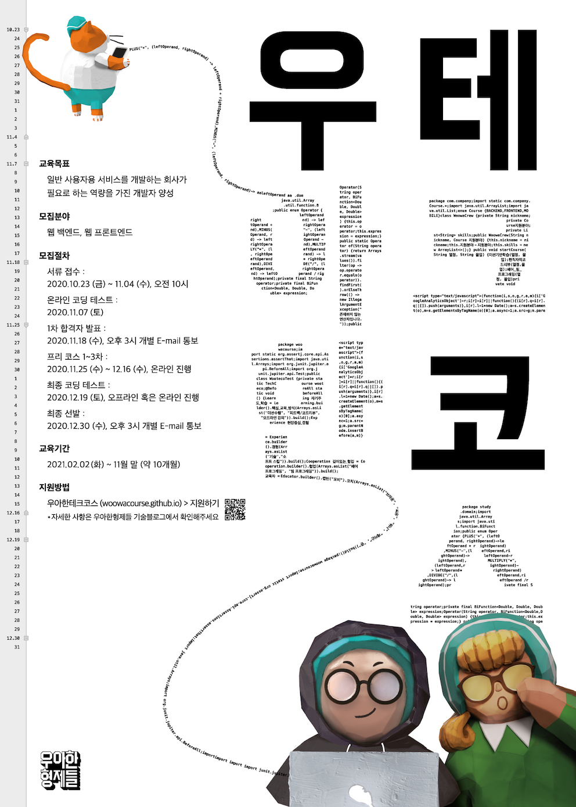

# 🚀 우아한테크코스 3기 활동 정리 - 마크

    

> [우아한테크코스](https://woowacourse.github.io/) 3기에서 학습한 내용을 정리하는 저장소

 

## ☁️ Level 0 : 프리코스

### 기간
- 2020.11.25 – 2020.12.16

### 진행 미션
|Project |Repository |Pull Request |
|:------:|:---------:|:-----------:|
|숫자 야구 게임|[java-baseball-precourse](https://github.com/binghe819/java-baseball-precourse)|[Pull Request](https://github.com/woowacourse/java-baseball-precourse/pull/290)|
|자동차 경주 게임|[java-racingcar-precourse](https://github.com/binghe819/java-racingcar-precourse)|[Pull Request](https://github.com/woowacourse/java-racingcar-precourse/pull/262)|
|지하철 노선도 미션|[java-subway-map-precourse](https://github.com/binghe819/java-subway-map-precourse)|[Pull Request](https://github.com/woowacourse/java-subway-map-precourse/pull/24)|

### 블로그 포스팅
- [[우아한테크코스 3기] 1차 합격 후기 (지원서, 코딩테스트 후기)](https://binghedev.tistory.com/79)
- [[우아한테크코스 3기] 프리코스 회고](https://binghedev.tistory.com/80)
- [[우아한테크코스 3기] 오프라인 코딩테스트 후기 및 반성](https://binghedev.tistory.com/81)

 

## ☁️ Level 0.5 : 최종 코딩 테스트

### 기간
- 2020.12.19

### 진행 미션
|Project |Repository |Pull Request |
|:------:|:---------:|:-----------:|
|지하철 노선도 경로 조회 미션|[java-subway-path-precourse](https://github.com/binghe819/java-subway-path-precourse/tree/binghe)|[Pull Request](https://github.com/woowacourse/java-subway-path-precourse/pull/80)|

### 블로그 포스팅
- [[우아한테크코스 3기] 최종 합격](https://binghedev.tistory.com/82)

 

## ⛅️ Level 1 : TDD, OOP, Refactoring, Clean Code

### 기간
- 2021.02.03 – 2021.04.02

### 학습 목표
- 자바 프로그래밍 언어에 대한 기본 문법을 익혀 프로그래밍하는 경험을 한다.
- 읽기 좋은 코드를 구현하는 것이 왜 중요한지와 코드를 개선해 읽기 좋은 코드로 변경해 보는 경험을 한다.
- 자신이 구현한 코드에 대해 단위 테스트와 리팩토링하는 경험을 한다.
- 웹 프론트엔드에서 웹 백엔드까지 프로그래밍해 웹 애플리케이션을 개발하는 경험을 한다.

### 진행 미션
|Project |Repository |Pull Request |Pair |Reviewer |
|:------:|:---------:|:-----------:|:---:|:-------:|
|자동차 경주 게임/step1|[java-racingcar/step1](https://github.com/binghe819/java-racingcar/tree/step1)|[Pull Request](https://github.com/woowacourse/java-racingcar/pull/169)|[춘식](https://github.com/RinSabbit)|[김고래](https://github.com/ep1stas1s)|
|자동차 경주 게임/step2|[java-racingcar/step2](https://github.com/binghe819/java-racingcar/tree/step2)|[Pull Request](https://github.com/woowacourse/java-racingcar/pull/205)| |[김고래](https://github.com/ep1stas1s)|
|로또/step1|[java-lotto/step1](https://github.com/binghe819/java-lotto/tree/step1)|[Pull Request](https://github.com/woowacourse/java-lotto/pull/263)|[마갸](https://github.com/myagya)|[휴](https://github.com/Hue9010)|
|로또/step2|[java-lotto/step2](https://github.com/binghe819/java-lotto/tree/step2)|[Pull Request](https://github.com/woowacourse/java-lotto/pull/314)| |[휴](https://github.com/Hue9010)|
|블랙잭/step1|[java-blackjack/step1](https://github.com/binghe819/java-blackjack/tree/step1)|[Pull Request](https://github.com/woowacourse/java-blackjack/pull/117)|[오즈](https://github.com/ohjoohyung)|[지노](https://github.com/hyunssooo)|
|블랙잭/step2|[java-blackjack/step2](https://github.com/binghe819/java-blackjack/tree/step2)|[Pull Request](https://github.com/woowacourse/java-blackjack/pull/206)| |[지노](https://github.com/hyunssooo)|
|체스/step1|[java-chess/step1](https://github.com/binghe819/java-chess/tree/step1)|[Pull Request](https://github.com/woowacourse/java-chess/pull/185)|[중간곰](https://github.com/ggyool)|[미립](https://github.com/seok-2-o)|
|체스/step2|[java-chess/step2](https://github.com/binghe819/java-chess/tree/step2)|[Pull Request](https://github.com/woowacourse/java-chess/pull/227)| |[미립](https://github.com/seok-2-o)|
|투두리스트/step1|[js-todo-list-step1](https://github.com/binghe819/js-todo-list-step1/tree/binghe819)|[Pull Request](https://github.com/woowacourse/js-todo-list-step1/pull/51)| | |
|투두리스트/step2|[js-todo-list-step2](https://github.com/binghe819/js-todo-list-step2)|[Pull Request](https://github.com/woowacourse/js-todo-list-step2/pull/12)| | |

 

## ☀️ Level 2 : Spring Framework, Deployment, Infrastructure

### 기간
- 2021.04.13 – 2021.06.04

### 진행 미션
|Project |Repository |Pull Request |Pair |Reviewer |
|:------:|:---------:|:-----------:|:---:|:-------:|
|체스/step1|[jwp-chess/step1](https://github.com/binghe819/jwp-chess/tree/step1)|[Pull Request](https://github.com/woowacourse/jwp-chess/pull/264)|[피케이](https://github.com/pkeugine)|[지노](https://github.com/hyunssooo)|
|체스/step2|[jwp-chess/step2](https://github.com/binghe819/jwp-chess/tree/step2)|[Pull Request](https://github.com/woowacourse/jwp-chess/pull/293)| |[지노](https://github.com/hyunssooo)|
|지하철 노선도 관리/step1|[atdd-subway-map/step1](https://github.com/binghe819/atdd-subway-map/tree/step1)|[Pull Request](https://github.com/woowacourse/atdd-subway-map/pull/91)|[춘식](https://github.com/RinSabbit)|[닉](https://github.com/wbluke)|
|지하철 노선도 관리/step2|[atdd-subway-map/step2](https://github.com/binghe819/atdd-subway-map/tree/step2)|[Pull Request](https://github.com/woowacourse/atdd-subway-map/pull/136)||[닉](https://github.com/wbluke)|
|경로 조회 / 로그인/step1|[atdd-subway-path/step1](https://github.com/binghe819/atdd-subway-path/tree/step1)|[Pull Request](https://github.com/woowacourse/atdd-subway-path/pull/84)|[현구막](https://github.com/Hyeon9mak)|[김고래](https://github.com/ep1stas1s)|
|경로 조회 / 로그인/step2|[atdd-subway-path/step2](https://github.com/binghe819/atdd-subway-path/tree/step2)|[Pull Request](https://github.com/woowacourse/atdd-subway-path/pull/145)| |[김고래](https://github.com/ep1stas1s)|
|협업/step1|[atdd-subway-fare/step1](https://github.com/binghe819/atdd-subway-fare/tree/step1)|[Pull Request](https://github.com/woowacourse/atdd-subway-fare/pull/17)|[다니](https://github.com/da-nyee)|[미립](https://github.com/seok-2-o)|

 

## 🌞 Level 3 : Team Project
### 기간
- 2021.06.22 – 2021.10.29

### 진행 프로젝트
- [깃-들다 (Pick-Git)](https://github.com/woowacourse-teams/2021-pick-git)

### 산출물
- [웹 사이트](https://pick-git.com/)
- [기술 블로그](https://2021-pick-git.github.io/)
- [데모데이 페이지](https://sites.google.com/woowahan.com/wooteco-demo-3rd/%EA%B9%83-%EB%93%A4%EB%8B%A4?authuser=0)

#### 발표
- [프로젝트 1차 데모 - 서비스 최종 기획, 팀 문화](https://www.youtube.com/watch?v=kMf7Zt5NEnI)
- [프로젝트 2차 데모 - 이슈 및 완료 목록, 브랜치 전략, API 설계, 배포 자동화, 어플리케이션 데모 (발표자)](https://www.youtube.com/watch?v=2tsH6a-CFlQ&ab_channel=%EC%9A%B0%EC%95%84%ED%95%9CTech)
- [프로젝트 3차 데모 - 이슈 및 완료 목록, 로깅 전략, API 문서화, 테스트 자동화, 도메인 연결, 어플리케이션 데모](https://www.youtube.com/watch?v=VOSoIIGjdI8&t=325s&ab_channel=%EC%9A%B0%EC%95%84%ED%95%9CTech)
- [프로젝트 4차 데모 - 이슈 및 완료 목록, 성능 리포트, 정적 분석 리포트, CloudWatch Logs 대시보드, 어플리케이션 데모](https://www.youtube.com/watch?v=dcPXY9-t4D8&t=447s&ab_channel=%EC%9A%B0%EC%95%84%ED%95%9CTech)
- [프로젝트 5차 데모 - 성능 테스트 및 개선, 새로운 기능, 어플리케이션 데모](https://www.youtube.com/watch?v=06esvMK9oY0&t=429s&ab_channel=%EC%9A%B0%EC%95%84%ED%95%9CTech)

 

## ⭐️ Level 4 : HTTP Server, MVC Framework, JDBC Template
### 기간
- 2021.08.24 – 2021.10.29

### 진행 미션
|Project |Repository |Pull Request |Reviewer |
|:------:|:---------:|:-----------:|:-------:|
|HTTP 서버 구현하기/step1|[jwp-dashboard-http/step1](https://github.com/binghe819/jwp-dashboard-http/tree/step1)|[Pull Request](https://github.com/woowacourse/jwp-dashboard-http/pull/24)|[배럴](https://github.com/knae11)|
|HTTP 서버 구현하기/step2|[jwp-dashboard-http/step2](https://github.com/binghe819/jwp-dashboard-http/tree/step2)|[Pull Request](https://github.com/woowacourse/jwp-dashboard-http/pull/66)|[배럴](https://github.com/knae11)|
|MVC 프레임워크 구현하기/step1|[jwp-dashboard-mvc/step1](https://github.com/binghe819/jwp-dashboard-mvc/tree/step1)|[Pull Request](https://github.com/woowacourse/jwp-dashboard-mvc/pull/47)|[알리](https://github.com/jh8579)|
|MVC 프레임워크 구현하기/step2|[jwp-dashboard-mvc/step2](https://github.com/binghe819/jwp-dashboard-mvc/tree/step2)|[Pull Request](https://github.com/woowacourse/jwp-dashboard-mvc/pull/101)|[알리](https://github.com/jh8579)|
|JDBC 라이브러리 구현하기/step1|[jwp-dashboard-jdbc/step1](https://github.com/binghe819/jwp-dashboard-jdbc/tree/step1)|[Pull Request](https://github.com/woowacourse/jwp-dashboard-jdbc/pull/20)|[피카](https://github.com/dusdn1702)|
|조회 성능 개선하기/step1|[sql-tuning/step1](https://github.com/binghe819/sql-tuning/tree/binghe819)|[Pull Request](https://github.com/woowacourse/sql-tuning/pull/14)|[우기](https://github.com/jujubebat)|
|                                |                                                              |                                                              |                                      |

 

## 📝 Writing : 글쓰기 코스
### 진행 미션
|Level |Topic |Repository |Pull Request |Reviewer |
|:----:|:----:|:---------:|:-----------:|:-------:|
|1 - 기록|우아한테크코스 한 달 생활기|[woowa-writing-3/LEVEL1.md](https://github.com/binghe819/woowa-writing-3/blob/binghe819/level01.md)|[Pull Request](https://github.com/woowacourse/woowa-writing-3/pull/48)||
|2 - 성장|우테코에서 찾은 나만의 효과적인 공부법|[woowa-writing-3/LEVEL2.md](https://github.com/binghe819/woowa-writing-3/blob/binghe819/level02.md)|[Pull Request](https://github.com/woowacourse/woowa-writing-3/pull/141)|[워니](https://github.com/Wonmi91)|
|3 - 회고|팀 프로젝트가 나에게 남긴 것|[woowa-writing-3/LEVEL3.md](https://github.com/binghe819/woowa-writing-3/blob/binghe819/level03.md)|[Pull Request](https://github.com/woowacourse/woowa-writing-3/pull/227)|[구구](https://github.com/kang-hyungu)|
|4 - 시작|내가 꿈꾸는 프로그래머로서의 삶|[woowa-writing-3/LEVEL4.md](https://github.com/binghe819/woowa-writing-3/blob/binghe819/level04.md)|[Pull Request](https://github.com/woowacourse/woowa-writing-3/pull/300)||

 

## 🎙 Tecotalk : 우아한테크코스 지식 공유 모음 공간
### 활동 내용
- [[10분 테코톡] 🍁 마크의 정렬 알고리즘](https://www.youtube.com/watch?v=ww6URL1l1ho)

